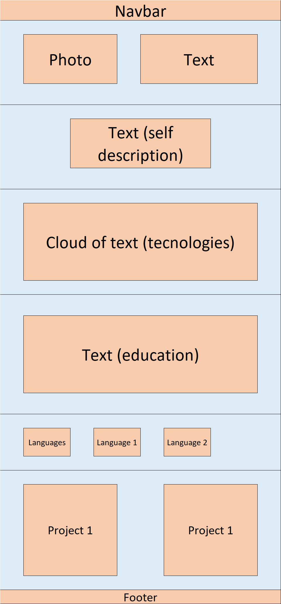
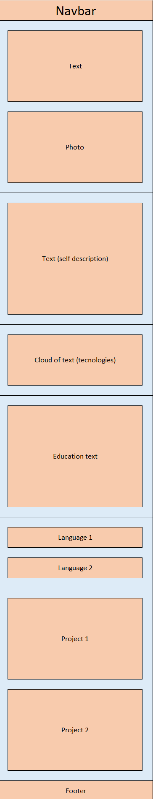
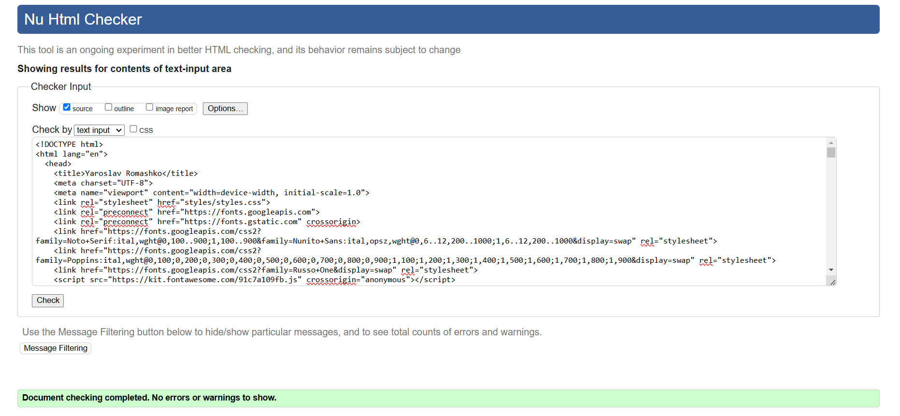
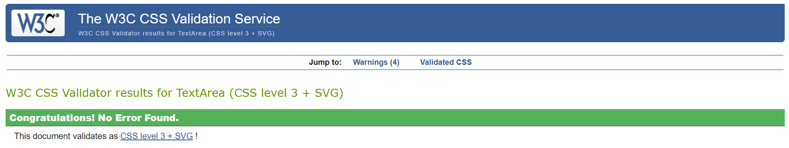

# Loppuraportti: Henkilökohtainen verkkosivu

**(Linkki sivuston pääsivulle: [https://romashkoyp.github.io/portfolio/](https://romashkoyp.github.io/portfolio/))**

## 1. Synopsis

**Mitä tehdään?** Henkilökohtainen verkkosivu, joka toimii interaktiivisena ja yksityiskohtaisempana versiona ansioluettelosta.

**Kenelle tehdään?** Kohderyhmänä ovat potentiaaliset työnantajat, kuten henkilöstöhallinnon edustajat ja osastopäälliköt. He ovat tyypillisesti 30+ vuotiaita korkeakoulutettuja henkilöitä, joilla on alan kokemusta. Sivustoa käytetään todennäköisesti työasemalla, mutta mobiilikäyttö on myös huomioitu.

**Kuka tekee?** Minä toteutan projektin kokonaisuudessaan. Testausvaiheessa pyydän palautetta tuttaviltani mm. käytettävyydestä ja englanninkielisen version tarpeellisuudesta.

**Laajuus?** Etusivun on tarkoitus antaa yleiskuvan minuun minuutissa.  Sieltä voi navigoida tarkempiin osioihin: koulutus, työkokemus, projektit ja harrastukset. Pääpaino on aiemmissa projekteissa, jotka demonstroivat osaamistani.

**Mihin ympäristöön?** Sivusto julkaistaan GitHub Pages -palvelussa.

**Turvallisuus?** Sivustolla käytetään HTTPS-protokollaa.

**Layout/Käyttöliittymä?** Responsiivinen design mukautuu eri näyttökokoihin. Fonttien ja kuvien luettavuus on varmistettu myös pienillä näytöillä.

**Ylläpito?** Sivustoa päivitetään uuden sisällön ja teknologiapäivitysten myötä. Säännöllinen testaus varmistaa sivuston toimivuuden.

**Materiaalin kerääminen ja medioiden käyttö?** Sivustolla käytetään optimoituja kuvia. Kaikkien materiaalien tekijänoikeudet on huomioitu.

## 2. Rakennekaavio

Verkkosivu
├── Navigointipalkki
│ ├── Profiili
│ ├── Taidot
│ ├── Koulutus
│ └── Projektit
├── Pääosio
│ ├── Profiilikuva ja otsikko
│ ├── Profiiliteksti
│ ├── Taidot (visuaalinen esitys)
│ ├── Koulutustiedot
│ ├── Kielet
│ └── Projektit (kuvaukset ja linkit)
└── Alatunniste
├── Yhteystiedot
└── Tekijänoikeustiedot

## 3. Layout-suunnitelma

### Desktop version

### Mobile version

## 4. Testaamistulokset

**Selaimet:**

* Firefox v. [132.0.1 (64-bit)]: Toimii moitteettomasti.
* Chrome v. [131.0.6778.109 (Official Build) (64-bit)]: Toimii moitteettomasti.
* Edge v. [131.0.2903.86]: Toimii moitteettomasti.Version 131.0.2903.86

**Validatorin tulokset:**

### HTML

### CSS

## 5. Resurssien erittely

| Työvaihe         | Aika (arvio) |
|------------------|--------------|
| Suunnittelu       | 1 tunti      |
| Layoutin toteutus | 2 tuntia      |
| Sisällöntuotanto  | 16 tuntia      |
| Testaus/korjaus   | 4 tuntia      |
| Dokumentointi     | 2 tuntia      |

## 6. Kommentit ja itsearvio

Mielestäni se on hyvä sivusto. Se ei ole ensimmäinen tekemäni sivusto, mutta tein sen uudella menetelmällä ja suunnitteluun kiinnitettiin erityistä huomiota. Mukauttaminen mobiiliversiota varten oli myös hyvä. Se oli hieman vaivalloista, mutta se oli sen arvoista.